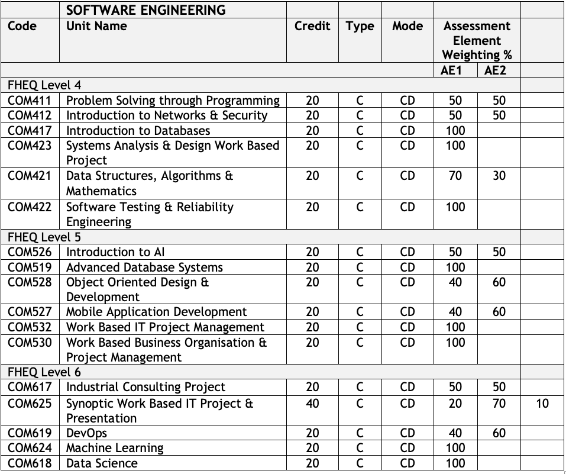
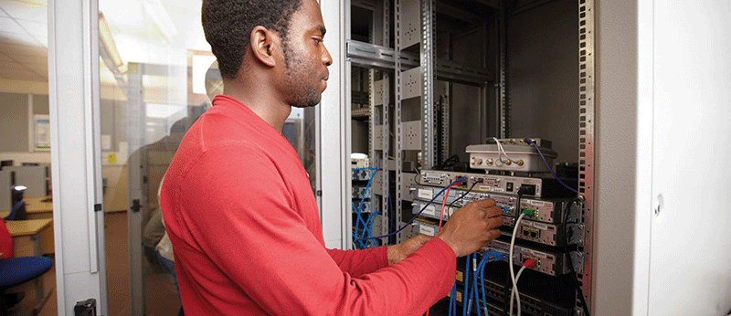

# BSC (HONS) DIGITAL AND TECHNOLOGY SOLUTIONS (BDATS)

As a Digital Technology Solutions apprentice, you will be guided by a curriculum that has been developed in association with BT, HP, IBM and GSM to develop the skills relevant to your specific job role. Depending on which route you and your employer choose, you will have the opportunity to learn valuable industry knowledge which will prepare you for accreditations from CISCO and the EC-Council.

Throughout the apprenticeship, you'll gain core technical knowledge that encompasses project management, business strategy, developing and delivering technology and software solutions, computer networking, and data management.

[(BSc (Hons) Digital and Technology Solutions (Apprenticeship)](https://www.solent.ac.uk/courses/apprenticeship/digital-technology-solutions-bsc)

[Apprenticeships: A guide for employers](https://www.solent.ac.uk/courses/info/higher-degree-apprenticeships/apprenticeships-guide-employers)

We currently offer the digital and technology solutions professional pathway aligned to the Institute for Apprenticeships standard.

[BSc Digital Technology Solutions (Apprentice) Standard](https://www.instituteforapprenticeships.org/apprenticeship-standards/digital-and-technology-solutions-professional-integrated-degree/)

### Martin Reid

Course Leader and Apprenticeship Programme Manager - Digital

martin.reid@solent.ac.uk 

## Introduction to Computing  Apprenticeships at Solent University

<iframe src="https://solent.cloud.panopto.eu/Panopto/Pages/Embed.aspx?id=a7159d29-1e9e-459d-a695-ac3b01722c27&autoplay=false&offerviewer=true&showtitle=true&showbrand=false&start=0&interactivity=all" height="405" width="720" style="border: 1px solid #464646;" allowfullscreen allow="autoplay"></iframe>

## The apprenticeship offers a number of pathways, depending on where you wish to specialise:

* Software Engineer
* Network Engineer 
* Data Analyst 
* Cybersecurity Specialist
* IT Consultant
* Business Analyst

### Software Engineer

A software engineer needs to be able to design, develop, build and test high-quality software solutions. This role requires apprentices to apply engineering principles at all levels of the software development process. This includes requirement gathering, analysis and design, development and data requirements, while ensuring security robustness is built in. Software engineers typically work as part of a larger collaborative team and will have responsibility for significant elements of software projects.

### Network Engineer

The primary role of a network engineer is to design, install, maintain and support communication networks within an organisation or between organisations. They need to maintain high levels of network performance and availability for users. They must also understand network configuration, cloud, network administration, and monitoring tools, and be able to give technical advice and guidance. Network engineers must be proficient in technology solutions to be able to analyse system requirements to ensure the network and its services operate to desired levels. Network engineers also understand data traffic and transmission across the network and have a major role to play in ensuring network security.

### Data Analyst

The role of a data analyst is to collect, organise and study data that can provide new business insight. This data is then compiled and used to inform decision making at all levels of the business. A data analyst is involved with managing, cleansing, abstracting and aggregate data across the network infrastructure. They also have a good understanding of data structures, software development procedures and the tools used to undertake standard and custom analytical studies, providing data solutions to a range of business issues.

### Cyber Security Specialist

A cyber security specialist is responsible for the implementation, maintenance and support of the security controls that protect an organisation’s systems and data assets, ensuring security technologies and practices are operating in accordance with the organisation's policies and standards to provide continued protection. They are responsible for performing vulnerability assessments to evaluate an organisation's ongoing security and provide visibility to management of the main risks and control status on an ongoing basis. They also respond to security incidents and implement resolution activities across an organisation. Cyber security specialists require a broad understanding of network infrastructure, software and data to identify where threat and hazard can occur.

### IT Consultant

IT consultants require a broad set of skills in areas such as business analysis, solutions development, network infrastructure, data, and cyber security. They use their consulting skills to advise clients on how to best utilise technology to meet business objectives and increase productivity. They also provide strategic guidance with regard to technology, and facilitate changing business processes through enhancements to technology solutions. IT consultants also provide technical assistance and often provide training.

### Business Analyst

Business analysts are responsible for assessing the impact of change - capturing, analysing and documenting requirements; and working with stakeholders to deliver projects that meet business requirements. They create detailed analysis of systems to make recommendations for improvement and produce specifications of user requirements that enable software engineers to develop the right software solutions. They require a broad set of skills and knowledge to be able to be effective as their work incorporates all aspects of digital technology systems.

## Study Days

What will be my university study day?

Tuesdays - 1st Year (Level 4)

Wednesdays - 2nd Year (Level 5)

Thursdays - 3rd Year (Level 6)

In some cases study days might be on a different day than above this will be done in consultation with you and your employer

[Download the Module delivery diagram for all pathways](DATS_MAP_SEPT_JAN_START_v10-5-2021.pdf)

### Module Descriptors
[Download Level 4 (1st year) Module Descriptors](info/Level 4 Modules-20210525.zip)

[Download Level 5 (2nd year) Module Descriptors](info/Level 5 Modules-20210525.zip)

[Download Level 6 (3rd year) Module Descriptors](info/Level 6 Modules-20210525.zip)
