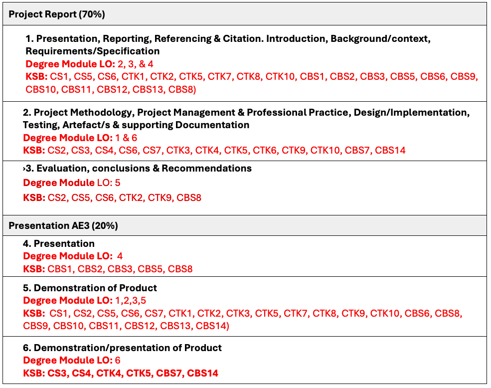
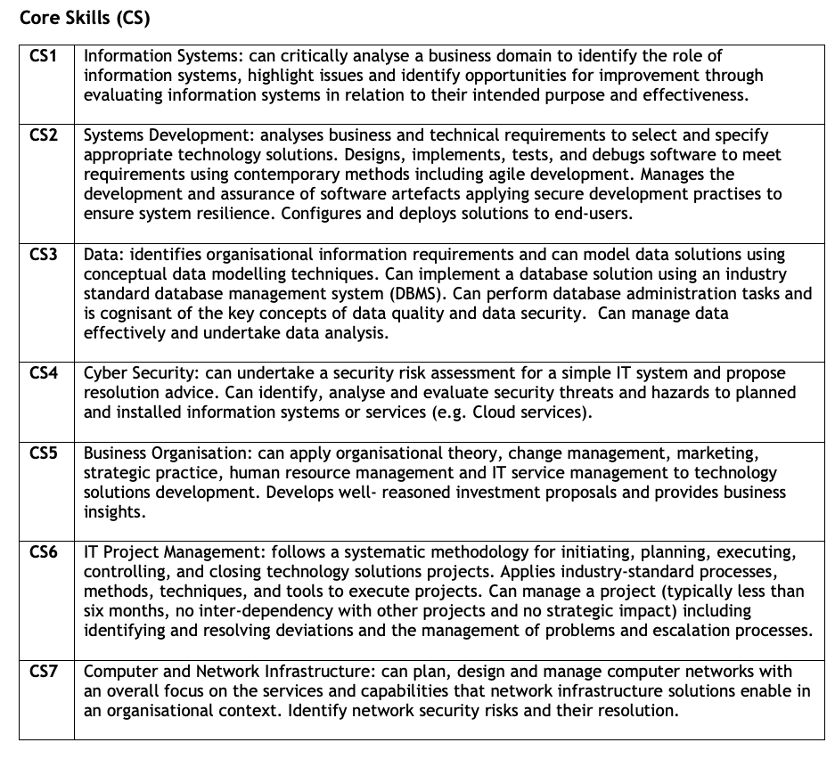
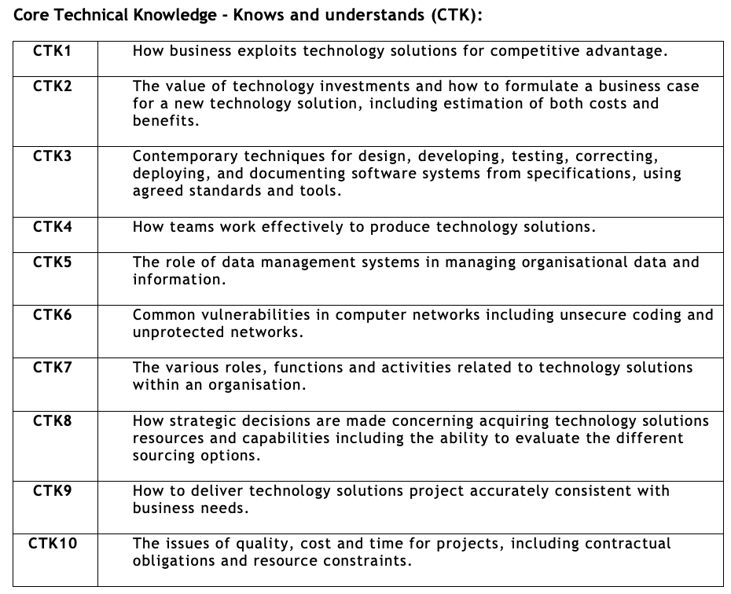
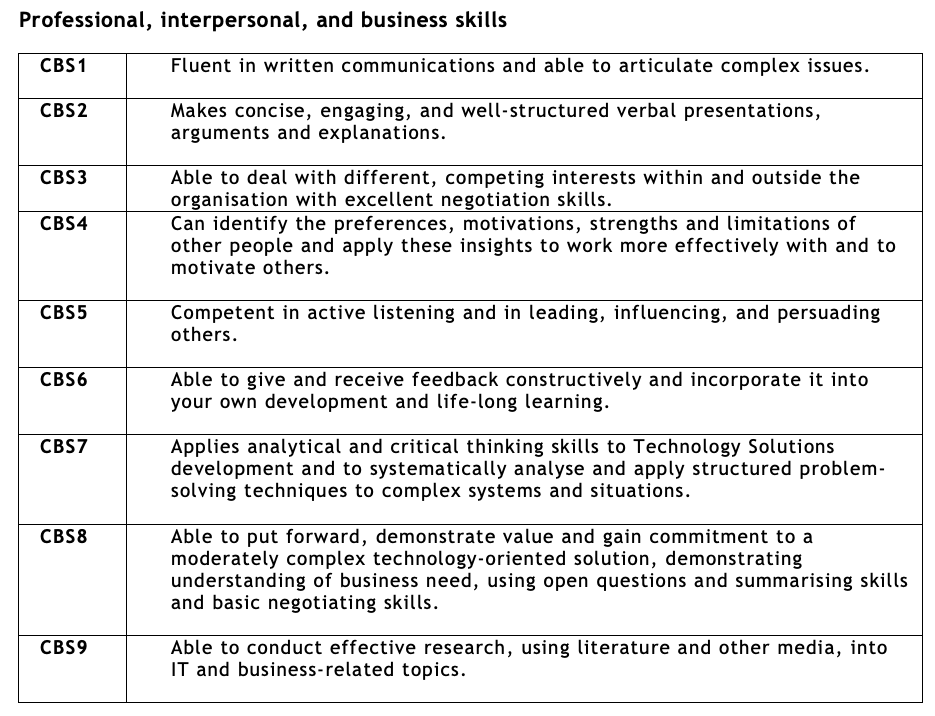
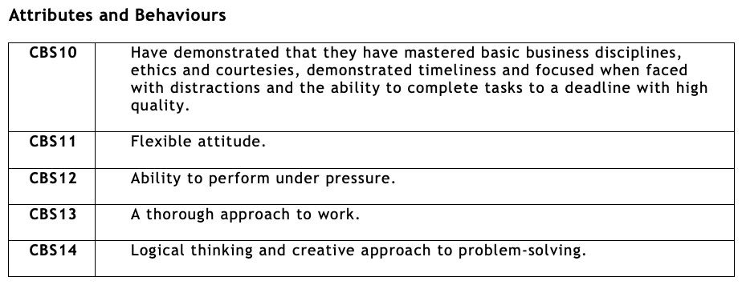
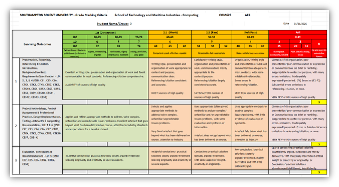

{: .no_toc }

# EPA Assessor Training 1.1

	<iframe src="https://solent.cloud.panopto.eu/Panopto/Pages/Embed.aspx?id=f2bd8056-15f8-4960-8b9f-b36d012d17fd&autoplay=false&offerviewer=true&showtitle=true&showbrand=true&captions=true&interactivity=all" style="border: 1px solid #464646; position: absolute; top: 0; left: 0; width: 100%; height: 100%; box-sizing: border-box;" allowfullscreen allow="autoplay" aria-label="Panopto Embedded Video Player" aria-description="DTS 1.1 - EPA Assessor Overview 2025 v2"></iframe>

[Download Slides](../info/EPA_1-1_Assessor_Train_25/DTS_EPA_assessor_info_9-25_v2.pptx)

[Download EPA Assessor Pack](../info/EPA_1-1_Assessor_Train_25/DTS_EPA_1_1_Pack_v2.zip) this pack contains:

* Assessor Presentation slides (pptx)
* EPA Project Assessor Overview (PDF)
* EPA 1-1 Briefing Document (PDF)
* EPA blank Feedback Document (doc)
* EPA Presentation Question Bank (PDF)
* Grade mark calculator AE2 & AE3 (Excel)

**Synoptic Project Report & Presentation Assessor Overview**

**BSc Digital and Technology Solutions Professional**
Apprenticeship Standard: [ST0119 v1.1 (2015)](https://skillsengland.education.gov.uk/apprenticeships/st0119-v1-1)

The Synoptic Project is undertaken during the final six months of the apprenticeship. Apprentices are required to complete and document a work-based project, supported by their employer and Solent University tutors.

A 10,000-word report must be submitted using a standard template. Within this report, apprentices are expected to demonstrate how they have met the Knowledge, Skills and Behaviours (KSBs) required for the assessment. Evidence of this should be included both in the main body of the report and in a mapping table located in the appendices.

Apprentices on the Digital and Technology Solutions apprenticeship will also complete a mapping matrix that outlines learning across all credited modules, including assessed work-based learning. This matrix (not directly assessed) provides assurance that the apprentice has achieved broad coverage of the KSBs defined in the apprenticeship standard.

	<iframe src="https://solent.cloud.panopto.eu/Panopto/Pages/Embed.aspx?id=91394b38-1ec5-4393-a55c-b36d013f803f&autoplay=false&offerviewer=true&showtitle=true&showbrand=true&captions=true&interactivity=all" style="border: 1px solid #464646; position: absolute; top: 0; left: 0; width: 100%; height: 100%; box-sizing: border-box;" allowfullscreen allow="autoplay" aria-label="Panopto Embedded Video Player" aria-description="EPA Assessor PDF Overview Walkthrough"></iframe>

[Download Assessor Overview Guide](../info/EPA_1-1_Assessor_Train_25/EPA_Project_Assessor_Overview_v4.pdf)

The assessment structure for the synoptic project under the legacy version of the Digital & Technology Solutions Degree Apprenticeship. Unlike newer standards that rely solely on independent assessors to conduct and grade the End Point Assessment (EPA) Assessment, this version involves a collaborative assessment model with university module assessor/s, employer input and external examiner processes.

Evidence of Competency
The Synoptic Project is designed to demonstrate full coverage of the Knowledge, Skills, and Behaviours (KSBs).

Evidence is drawn from:

* The main body of the report
* The appendix KSB mapping
* The KSB mapping portfolio, which documents learning throughout the apprenticeship

The EPA presentation serves as a capstone validation of the apprentice’s competencies, supported by their submitted work.

 

**SKILLS ENGLAND GOV, 2015.** DIGITAL INDUSTRIES -ASSESSMENT PLAN DIGITAL & TECHNOLOGY SOLUTIONS PROFESSIONAL BSC (Hons) Digital & Technology Solutions
 [viewed 14 September 2025]. Available from: [https://skillsengland.education.gov.uk/media/1073/digital_and_technology_solutions_professional.pdf](https://skillsengland.education.gov.uk/media/1073/digital_and_technology_solutions_professional.pdf)

The Synoptic Project is assessed through a structured discussion involving:

* The apprentice
* Their university lecturer(s)
* Their employer

This discussion focuses on:

* What the apprentice has done
* he standard of their work
* *How they have done it

(As outlined in the official assessment plan: Assessment Plan – DTS)

 

**Role of the Independent Assessor**
An independent assessor will be introduced to strengthen the integrity and consistency of grading. This assessor:

* Will not have taught or worked with the apprentice previously.
* Independent Assessor can be from within the institution but will act independently.
* Will serve as a second marker, applying university guidelines for 40-credit modules.
* Will collaborate with the employer and support tutor to agree the final grade and feedback.

**Assessment Process**

- The Independent Assessor will already have received the apprentice’s report and slide deck.

- They will have read the report, worked out provisional grading and feedback based on the assessment rubrics, and drafted some initial questions using the question bank.

- The Solent support tutor will also have read the report and worked out provisional grading and feedback.

- Assessors will check portfolio mapping matrix for good coverage of KSB's throughout the apprenticeship. This is not directly assessed but will be signed off on EPA feedback form.

- The assessment will take place online and will last for one hour (plus 10%).

- Presentation will need to be recorded for moderation

- Apprentices will deliver a 25–30-minute presentation on their Synoptic Project.

- This will be followed by a 25–30-minute structured interview, led by the Independent Assessor, who will ask 4–6 questions with appropriate follow-ups.

- There will also be an opportunity for the employer to summarise the apprentice’s performance on the project, based on the reference included in the report.

- The apprentice will then leave the meeting. The Independent Assessor, Solent tutor, and employer will discuss and agree to the final grade and complete feedback.

**Guidance for Assessors – Use of Question Bank**  

	<iframe src="https://solent.cloud.panopto.eu/Panopto/Pages/Embed.aspx?id=23917a97-32e1-4ec3-9004-b36700a28cd4&autoplay=false&offerviewer=true&showtitle=true&showbrand=true&captions=true&interactivity=all" style="border: 1px solid #464646; position: absolute; top: 0; left: 0; width: 100%; height: 100%; box-sizing: border-box;" allowfullscreen allow="autoplay" aria-label="Panopto Embedded Video Player" aria-description="DTS EPA 1.1 Question Bank 2025"></iframe>

[Download DTS EPA Question Bank](../info/EPA_1-1_Assessor_Train_25/DTS_EPA_1-1_Q-Bank.pdf)

The question bank is provided as a starting point for independent assessors conducting the End Point Assessment (EPA) for the BSc (Hons) Digital & Technology Solutions Professional (integrated degree). The questions listed under each criterion are illustrative examples only. They are designed to reflect the types of knowledge, skills, and behaviours (KSBs) outlined in the apprenticeship standard and are generic in nature.  

Apprentices will be coming from different occupational pathways and will have different synoptic project focuses. Assessors will conduct a 25–30-minute interview, asking between 4–6 questions with appropriate follow-up questions. This interview follows the apprentice’s 25–30-minute presentation.  

The Synoptic Project submitted by the apprentice is designed to demonstrate full coverage of the core KSBs, both within the body of the report and the appendix project KSB mapping. In addition, apprentices will have submitted a comprehensive KSB mapping portfolio that evidence learning throughout the apprenticeship on all their credited modules. This ensures that the apprentice has achieved complete KSB coverage and provides a clear link between their work and the EPA assessment. The EPA interview is a capstone assessment to validate their competencies with reference to the submitted work.  

**Note:** These questions are not tailored to any specific specialism, apprentice’s project report or presentation. Instead, they serve as a foundation to help assessors craft contextualised and relevant questions that align with the actual content of the apprentice’s submitted work and presentation.  

**Assessors are encouraged to:**

- Use these examples to inspire and structure their own questions.

- Adapt the phrasing and focus based on the apprentice’s specialism, project scope, and organisational context.

- Ensure that the final questions used during the EPA interview are directly linked to the apprentice’s demonstrated work and mapped learning outcomes.

- Use them in conjunction with grade mark rubrics for the Synoptic Project EPA

**Apprentice KSB Mapping in Report**

This video walkthrough shows how the apprentices have been guided to demonstrate their knowledge, skills and behaviours (KSBs) within the main body of the report, and how these have been mapped in an appendix. This approach helps the apprentice understand how their project maps to the KSBs, and also supports assessors in carrying out assessments and grading their work

	<iframe src="https://solent.cloud.panopto.eu/Panopto/Pages/Embed.aspx?id=77720df6-7e19-4c1c-830b-b30f00f32363&autoplay=false&offerviewer=true&showtitle=true&showbrand=true&captions=true&interactivity=all" style="border: 1px solid #464646; position: absolute; top: 0; left: 0; width: 100%; height: 100%; box-sizing: border-box;" allowfullscreen allow="autoplay" aria-label="Panopto Embedded Video Player" aria-description="Claiming KSBs in Reports 2025"></iframe>

**Guidance for Assessors – Giving written feedback**

	<iframe src="https://solent.cloud.panopto.eu/Panopto/Pages/Embed.aspx?id=5ab4b42f-f7a1-434a-857c-b366012f9627&autoplay=false&offerviewer=true&showtitle=true&showbrand=true&captions=true&interactivity=all" style="border: 1px solid #464646; position: absolute; top: 0; left: 0; width: 100%; height: 100%; box-sizing: border-box;" allowfullscreen allow="autoplay" aria-label="Panopto Embedded Video Player" aria-description="DTS 1.1 - EPA Assessor Feedback Form"></iframe>

**Written feedback plays a vital role in the End-Point Assessment (EPA) process** It should be clear, constructive and aligned with the assessment criteria. The aim is to provide apprentices with a fair and transparent summary of their performance, while also supporting quality assurance and moderation.

**Best Practice for Written Feedback:**

- **Be specific and evidence-based:** Feedback should refer directly to the apprentice’s work, using examples where possible. Avoid vague statements and focus on what was done well or where improvement is needed.

- **Link to the grading criteria**: Clearly explain how the apprentice has met (or not met) the requirements of the standard. Use the language of the grading descriptors to support consistency and clarity.

- **Balance strengths and areas for development**: Highlight what the apprentice did well, as well as areas that could be improved. This helps ensure feedback is balanced and developmental.

- **Use accessible language**: Avoid jargon or overly technical terms unless they are relevant to the assessment. The feedback should be easy to understand for the apprentice and other stakeholders.

- **Be comprehensive but concise**: Feedback should cover all relevant aspects of the assessment, including technical knowledge, skills, behaviours and professional practice. However, it should remain focused and avoid unnecessary repetition.

- **Maintain a professional tone**: Feedback should be respectful, impartial and supportive. It should reflect the seriousness of the EPA process and the importance of the apprentice’s achievement.

- **Support moderation and audit**: Ensure feedback is detailed enough to support internal and external quality assurance. It should justify the grade awarded and be consistent with the evidence presented.

There is a blank feedback sheet titled [BLANK_EPA_1-1_FEEDBACK](../info/EPA_1-1_Assessor_Train_25/BLANK_EPA_1-1_FEEDBACK_2025_v4.docx), and a partially populated sheet called [RESPONSE_EPA_1-1_FEEDBACK](../info/EPA_1-1_Assessor_Train_25/Response_EPA_1-1_FEEDBACK_2024_v4.pdf). The latter includes example responses from the apprentice, based on questions from the question bank and the grade mark criteria. You will also use the Excel grade calculator to come up with an overall average numeric value.

**Guidance for Assessors - Grading the Assessment**

The Synoptic Project module is a credited part of the Digital and Technology Solutions degree. Apprentices must pass this module to complete the degree and they must pass the degree to complete the apprenticeship.

**Final Assessment and Grading**  

All apprentices will be studying for a BSc Honours degree in Digital & Technology Solutions. It is the achievement of the Honours degree that demonstrates that the standard has been met, and which provides the grading.

**The grading of the degree award is significantly made up of the synoptic project assessment together with module assessments.** The Honours degree award and classification is based on a weighted average mark of the assessed work the apprentice has completed. The synoptic project contributes greatly to the final year marks. The final year overall contributes to the grading typically in the ratio of 3 – 5 times that of second year modules (based on a three-year model). The synoptic project must be passed in all cases to achieve the degree award.

Apprentices will be graded using Honours degree classifications for English universities. All UK universities must follow the QAA (Quality Assurance Agency for Higher Education) Code of practice for the assurance of academic quality and standards in higher education. This ensures continued consistency across universities.

**The national degree award outcomes are shown below with apprenticeship grading equivalence. These typically are as follows:**  

 

At Solent University, assessments are marked using a numeric grading system. Individual assessments use “stepped” grading, as shown below:

**Solent Numeric Grading**

 

**Solent Grading Criteria**

- **Extraordinary 100%**: This grade is for work that is truly exceptional in every way. The project demonstrates groundbreaking innovation and has a significant impact on the organisation. The report is meticulously detailed, and the presentation is highly engaging and professional.

- **Outstanding 92%**: This grade is for work that is significantly above average. The project shows a high level of creativity and effectiveness. The report is thorough and well-organised, and the presentation is clear and confident.

- **Excellent 83%**: This grade indicates very high-quality work. The project is well-executed and meets all the objectives effectively. The report is comprehensive and well-written, and the presentation is polished and informative.

- **Strong/Very Good 74%**: This grade is for work that is above average. The project is solid and achieves its goals. The report is detailed and clear, and the presentation is well-prepared and delivered.

- **Competent, good, effective, capable 62-65-69%**: This grade is for work that meets the basic requirements. The project is adequately executed and achieves its main objectives. The report is clear and covers the necessary points, and the presentation is satisfactory.

- **Reasonable, fair, appropriate 52-55-58%**: This grade is for work that is acceptable but has some shortcomings. The project meets most objectives but lacks depth or thoroughness. The report is adequate but may be missing some details, and the presentation is clear but not particularly engaging.

- **Basic, satisfactory, acceptable 42-45-48%**: This grade is for work that meets the minimum requirements. The project is completed but lacks depth and impact. The report covers the basics but is not detailed, and the presentation is clear but lacks enthusiasm.

- **Inadequate, incomplete, limited 35**: This grade is for work that does not meet the required standards. The project fails to achieve its main objectives. The report is incomplete or poorly organised, and the presentation is unclear or unprofessional.

- **Poor, unsatisfactory, weak 15-20%**: This grade is for work that is significantly below the required standards. The project is poorly executed and has little to no impact. The report is very incomplete or poorly written, and the presentation is unclear and unengaging.

**Guidance for Assessors - Grade Calculator for the Synoptic Project EPA (1.1)**

	<iframe src="https://solent.cloud.panopto.eu/Panopto/Pages/Embed.aspx?id=2b5a9f89-e93c-4a40-ae39-b36d011bf077&autoplay=false&offerviewer=true&showtitle=true&showbrand=true&captions=true&interactivity=all" style="border: 1px solid #464646; position: absolute; top: 0; left: 0; width: 100%; height: 100%; box-sizing: border-box;" allowfullscreen allow="autoplay" aria-label="Panopto Embedded Video Player" aria-description="EPA 1-1 Grader NEW 25 v2"></iframe>

This grade calculator is designed to support assessors in evaluating apprentices’ performance in the **Synoptic Project EPA**. It calculates an overall numeric grade and maps it to a classification:

The spreadsheet includes a structured list of learning outcomes across three domains:

[Download Excel Grade calculator](../info/EPA_1-1_Assessor_Train_25/COM625_AE2_AE3_grader_2025_v2.xlsx)

**Module Learning Outcomes (LO) and Corresponding Apprentice KSB**

COM625 Synoptic Report AE2 (70%) & Presentation AE3 (20%)

**Degree (Module) Learning Outcome**

1.	Select, apply and evaluate the appropriateness of methods, tools and technologies in the synthesis of meaningful project outcomes.
2.	Undertake a significant self-managed project in a planned and systematic fashion.
3.	Identify, interpret and integrate theory drawn from a range of appropriate sources.
4.	Communicate complex ideas fluently both verbally and in writing.
5.	Deliver a technology solution project accurately consistent with business needs
6.	Apply analytical and critical thinking skills to Technology Solutions development

**Knowledge, Skills and Behaviours (KSB) codes and criteria list**

Guidance for Assessors - Grade Calculator for the Synoptic Project EPA (1.1)

This grade calculator is designed to support assessors in evaluating apprentices’ performance in the Synoptic Project EPA on AE2 & AE3. The spreadsheet includes a KSB learning outcomes across three domains: Core Skills (CS), Core Technical Knowledge (CTK) and Core Behavioural Skills (KBS)

**Module Name: Synoptic Project and Presentation COM625**

* AE2: Synoptic Project Report (70% weighting)
* AE3: Presentation (20% weighting)

Structure of the Workbook -The workbook contains 6 sheets, each serving a specific purpose:

**1. Feedback Breakdown AE2**

Divides AE2 into three criteria:

* Presentation, Reporting, Referencing & Citation
* Methodology, Project Management, Design, Testing, Artefact
* Evaluation, Conclusions & Recommendations

Each criterion is linked to Learning Outcomes (LOs) and Knowledge, Skills, Behaviours (KSBs).

**1. Rubric AE2**

* Detailed marking rubric for AE2.
* Describes performance levels from Distinction (1st) to Fail, with descriptors for each criterion.
* Includes step marks (e.g., 92, 83, 74, etc.) and qualitative descriptors (e.g., “Superb, outstanding, original”).

**3. Overall Grade Mark AE2**

* Allows assessors to input individual criterion scores (0–10).
* Converts these into step marks and an overall grade.
* Includes a space for qualitative feedback.

**4. Feedback Breakdown AE3**

Like AE2 but tailored for the Presentation assessment:
* Presentation
* Demonstration of Product (LOs 1,2,3,5)
* Demonstration/Presentation of Product (LO 6)

**5. Rubric AE3**
* Marking rubric for AE3 with descriptors for each performance band.
* Aligns with the same grading scale and structure as AE2.

**6. Overall Grade Mark AE3**
* Input sheet for AE3 scores.
* Converts criterion scores into step marks and overall grade.
* Includes space for feedback.

**This Excel-based grader is designed to:**

* Standardise assessment across multiple assessors.
* Provide transparent, criterion-based grading.
* Ensure alignment with Learning Outcomes and KSBs.
* Facilitate moderation and feedback processes.
* Support apprenticeship and degree classification decisions.

**The numeric value for this module will contribute to the overall grade average for the final degree and apprenticeship classifications, in line with Southampton Solent’s grading regulations, to determine the final Apprenticeship degree classification. This might take up to 2 weeks to be confirmed**

