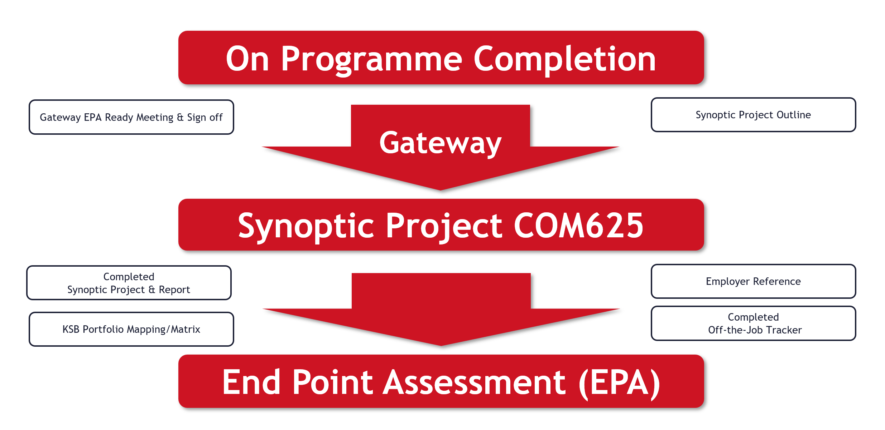
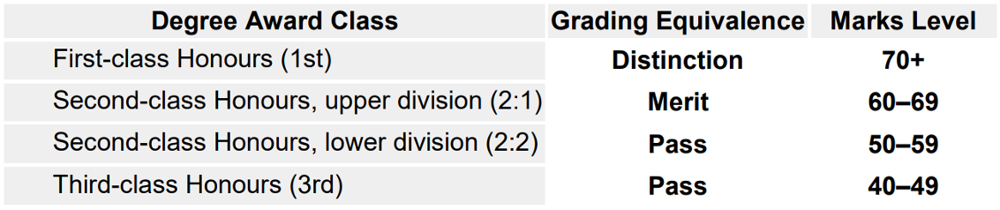
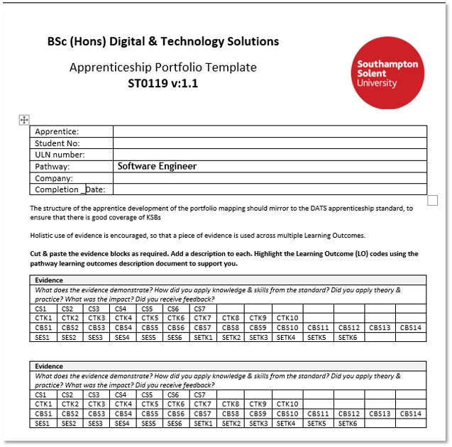
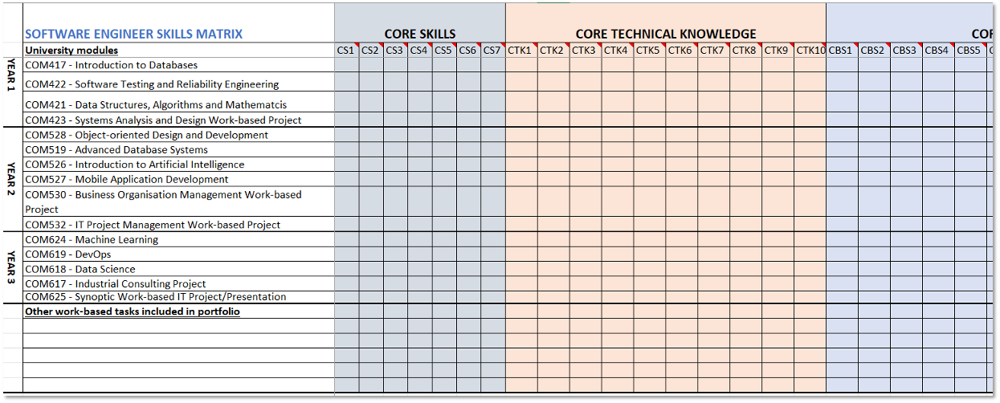

{: .no_toc }

#  BDATS Version 1.1 EPA

<iframe src="https://solent.cloud.panopto.eu/Panopto/Pages/Embed.aspx?id=d6c77208-38fe-4570-86cf-b2a600b0b221&amp;autoplay=false&amp;offerviewer=true&amp;showtitle=true&amp;showbrand=true&amp;captions=true&amp;interactivity=all" height="405" width="720" style="border: 1px solid #464646;" allowfullscreen="" allow="autoplay" aria-label="Panopto Embedded Video Player" aria-description="SYNOPTIC PROJECT &amp; EPA DTS 1.1 - 2025"></iframe>

[Download Slides](../info/COM625_INTRO_2025_v5E.pptx)

### Overall Assessment Strategy
The assessment strategy for the Degree Apprenticeship includes a balanced mix of essays, reports, practical exercises, coursework, and tests. These are mapped to each module of the BSc Digital & Technology Solutions Degree Apprenticeship to assess the development of Knowledge, Skills, and Behaviours (KSBs). The End Point Assessment (EPA) consists of a Synoptic Project and Presentation.

The Synoptic work-based project takes place near the end of the apprenticeship. It is a substantial piece of work and covers the skills, knowledge and behaviours defined in the standard. The End Point Assessment (EPA) integrates the project outcomes and presentation into the overall Synoptic Project Assessment.

**Two methods of assessment:**

1.	Synoptic Work based Project Practical & reporting
2.	Presentation 1 hour (30mins plus Q&A) with the Apprentice Independent Assessor, employer and Solent University Tutor

**INSTITUTE FOR APPRENTICESHIPS, 2015.** DIGITAL INDUSTRIES -ASSESSMENT PLAN DIGITAL & TECHNOLOGY SOLUTIONS PROFESSIONAL BSC (Hons) Digital & Technology Solutions. instituteforapprenticeships.org. Institute for Apprenticeships [viewed 18 October 2024]. Available from: https://www.instituteforapprenticeships.org/media/1073/digital_and_technology_solutions_professional.pdf

#### Overview of the Synoptic Project and EPA

**1. End Point Assessment (EPA) Structure:** The EPA is the final stage of the apprenticeship, designed to assess whether the apprentice has met the required standard. It usually consists of several components:
* Synoptic Project Work-Based Project
* Employer Reference
* Presentation, Q&A and discussion

The **Synoptic Project** is a key element of the EPA, testing the apprentice’s ability to apply their knowledge and skills in a real-world context.

**2. Synoptic Project Overview:**
* The **Synoptic Projec**t is a significant piece of work undertaken towards the end of the apprenticeship.
* Typically carried out over a period 6 months, the project addresses a real business or organisational need.
* It provides an opportunity for the apprentice to **demonstrate technical proficiency, problem-solving skills, and project management capabilities in an integrated manner.**
* The project may involve designing, developing, and implementing a solution using the digital and technology skills the apprentice has developed during their training.

**3. Key Assessment Criteria:** The Synoptic Project is evaluated against several core competencies, including:
* Technical Knowledge: Applying digital and technical concepts in areas such as software development, data analysis, cybersecurity, or IT solutions.
* Project Management: Planning, executing, and managing a project from start to finish, including time management, budgeting, and resource allocation.
* Problem-Solving: Effectively analysing problems and delivering practical solutions.
* Communication and Collaboration: Communicating technical information to both technical and non-technical stakeholders and working effectively within a team.
* Business Understanding: Demonstrating an understanding of the project’s strategic importance and how the digital solution impacts the business.
* Innovation and Adaptability: Showing creativity in problem-solving and adapting to changing requirements or unforeseen challenges during the project.

**4. Project Submission and Presentation:**
* The final project is typically submitted as a written report, detailing the problem, approach, and solution.
* The apprentice will present their project to a panel (25-30 min) consisting of an independent EPA assessor, project support tutor and employer/company representative.
* A **Q&A session** follows the presentation, allowing assessor to evaluate the apprentice’s understanding and depth of insight.
* **The EPA presentation assessment** will last 1 hour in total

**5. Integration of Learning:** The Synoptic Project is designed to be a comprehensive test of all the knowledge, skills, and behaviours developed throughout the apprenticeship

**6. Grading and Feedback:**
* The project will be assessed based on how well the apprentice meets the criteria set out in the A**pprenticeship Standard Knowledge, Skills and Behaviours (KSBs**) for Digital and Technology Solutions.
* Apprentices will be graded using Honours degree classifications for English universities. All UK universities must follow the QAA (Quality Assurance Agency for Higher Education) Code of practice for the assurance of academic quality and standards in higher education. This ensures continued consistency across universities.

The national degree award outcomes are shown below with apprenticeship grading equivalence. These typically are as follows:

* Detailed feedback is provided, highlighting strengths and areas for improvement.

**7. Employer Involvement:**
* Employers play a vital role in the Synoptic Project, often helping to define the project’s scope to ensure it meets both business needs and the assessment criteria.
* The apprentice with the support of their employer will scope out and provide a summary of what the project will cover and will submit and get sign off before starting the Synoptic Project using the supplied Project Outline form and project proposal template.
* The Employer Reference is another key component of the EPA, where the employer gives their assessment of the apprentice’s performance.

------------------

### Synoptic Project
The final Synoptic Project is a substantial piece of work, typically taking around 6 months to undertake alongside the apprentices' normal duties to their employer and will include doing practical work and report writing.

**AE1 – Report 1 - 10% (1500 words)**
The initial phase of the project focuses on defining its scope and purpose, including any relevant business, ethical, legal, and professional considerations. This phase also involves reviewing existing literature and developing a project plan. Feasibility and requirements are assessed during this stage as well.

**AE2 – Report 1 - 70% (10,000 words)**
The final project report should present a narrative of the project from inception to completion, aligned with the relevant Knowledge, Skills, and Behaviours (KSBs). It should outline the approaches taken, the rationale for their selection, and assess the project’s outputs in terms of their suitability for purpose. The report should also include conclusions, a critical review of the overall process, and recommendations for future development.

**AE3 – Demo/Presentation - 20% (25-30mins)**
To support your Project Report, you will need to give a presentation/demonstration of your project. You will receive formative feedback on your presentation before the EPA Presentation Assessment

## Project Selection

**The Project Aim**
The project should add value to your organisation, and it needs to hit the pathway learning outcomes (KSBs) that are in the apprenticeship standard.

**Project Selection**
All learning throughout the apprenticeship is designed to prepare for the Synoptic Project and the subsequent EPA assessment. Reminders and discussions about the EPA will be incorporated into work-based modules, reviews, and throughout the second year.

**Apprentice Project Support**
1.	Someone responsible for managing the project from the employer perspective.
2.	The university project tutor will oversee and provide support to the apprentice through the COM625 module.

**Project Sign Off**
The project topic must be discussed, agreed upon, and approved by the University, the Apprentice, and the company/manager before the project begins using the project outline form.

**Considerations**
Any issues with confidentiality and/or security will be addressed between the university, employer and apprentice allowing 

**Documentation**
A log book is is a good idea to track your daily progress, tasks, issues, and reflections. This can be digital or physical and will be help in the Write up stage

**Report Writing & Referencing**

Strength you academic skills 

## Doing the Project

**Project Outline**
A Project Outline needs to be completed and signed off by Southampton Solent University, the Apprentice and their employer - it's not graded. A template will be supplied and once completed should be no more than one side of A4.

**Final Report Structure**

For the final Synoptic Report, you will be provided with a template outlining the main sections required. You can add additional sections if necessary to fit the specific needs of your project.

1.	Title Page
2.	Acknowledgements
3.	Summary
4.	Contents
5.	List of Figures
6.	Project Specification/Requirements
7.	Methodology/Evaluation 
Professional, Legal and Ethical issues
Project Management
8.	Design, implementation
9.	Testing & Results
10.	Conclusions
11.	Recommendations for further Work and/or discussion
12.	References List
13.	Appendices

**Employer Reference**
The assessment of the Synoptic Project should include the employer’s evaluation against the common criteria and be presented in an appendix of the project report. 

**Portfolio Mapping**

Apprentices will have been mapping all their learning throughout the apprenticeship to the standard KSBs, coming up to EPA it is important that this mapping is up to date using the templates provided.

## Gateway
Upon completion of the on-programme training, a Gateway meeting will be arranged to ensure that the apprentice has completed and passed all modules and is ready to progress to the **Synoptic Project End Point Assessment (EPA)** - final 6 months (approx.) of the apprenticeship. This meeting will verify that a suitable project has been agreed by the apprentice, employer and the university and a project outline proposal has been submitted, off-the-job training tracker and portfolio KSB mapping should be current and up to date. A form will be completed by all parties to agree EPA readiness

**Apprentices will have support from the university throughout the Synoptic Project period right up to the EPA assessment**

## EPA Assessment Presentation

* Can be conducted face-to-face or online (Photo ID required)

* The Apprentice will present for 25-30 minutes, followed by a Q&A session within a 1-hour time slot
