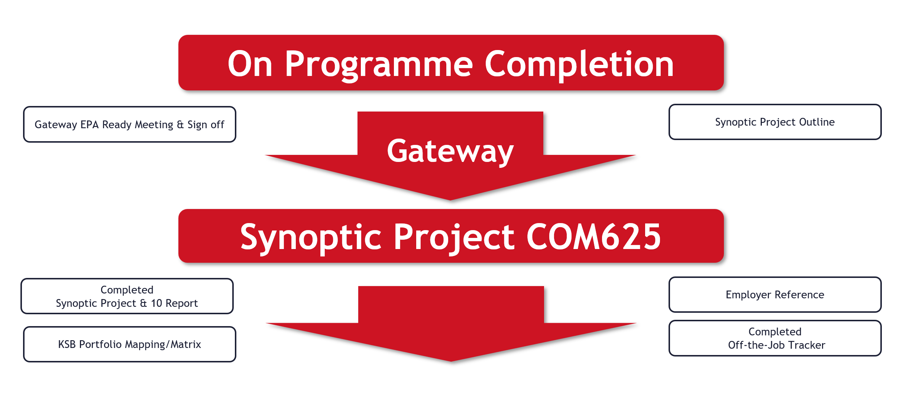

{: .no_toc }

#  BDATS Version 1.1 EPA

<iframe src="https://solent.cloud.panopto.eu/Panopto/Pages/Embed.aspx?id=6eb05ac4-a914-4d49-a8ce-b20d00f6eb18&autoplay=false&offerviewer=true&showtitle=true&showbrand=true&captions=true&interactivity=all" height="405" width="720" style="border: 1px solid #464646;" allowfullscreen allow="autoplay" aria-label="Panopto Embedded Video Player" aria-description="Synoptic Project &amp; EPA v:1.1" ></iframe>

[Download Slides](../images/COM625_INTRO_2024_v2.pptx)

### Overall Assessment Strategy
The assessment strategy for the Degree Apprenticeship includes a balanced mix of essays, reports, practical exercises, coursework, and tests. These are mapped to each module of the BSc Digital & Technology Solutions Degree Apprenticeship to assess the development of Knowledge, Skills, and Behaviours (KSBs). The End Point Assessment (EPA) consists of a Synoptic Project and Presentation.

The Synoptic work-based project takes place near the end of the apprenticeship. It is a substantial piece of work and covers the skills, knowledge and behaviours defined in the standard. The End Point Assessment (EPA) integrates the project outcomes and presentation into the overall Synoptic Project Assessment.

**Two methods of assessment:**

1.	Synoptic Work based Project Practical & reporting
2.	Presentation 1 hour (30mins plus Q&A) with the Independent Assessor

**INSTITUTE FOR APPRENTICESHIPS, 2015.** DIGITAL INDUSTRIES -ASSESSMENT PLAN DIGITAL & TECHNOLOGY SOLUTIONS PROFESSIONAL BSC (Hons) Digital & Technology Solutions. instituteforapprenticeships.org. Institute for Apprenticeships [viewed 18 October 2024]. Available from: https://www.instituteforapprenticeships.org/media/1073/digital_and_technology_solutions_professional.pdf

### Synoptic Project
The final Synoptic Project is a substantial piece of work, typically taking around 6 months to undertake alongside the apprentices' normal duties to their employer and will include doing practical work and report writing.

**AE1 – Report 1 - 10% (1500 words)**
The initial phase of the project focuses on defining its scope and purpose, including any relevant business, ethical, legal, and professional considerations. This phase also involves reviewing existing literature and developing a project plan. Feasibility and requirements are assessed during this stage as well.

**AE2 – Report 1 - 70% (10,000 words)**
The final project report should present a narrative of the project from inception to completion, aligned with the relevant Knowledge, Skills, and Behaviours (KSBs). It should outline the approaches taken, the rationale for their selection, and assess the project’s outputs in terms of their suitability for purpose. The report should also include conclusions, a critical review of the overall process, and recommendations for future development.

**AE3 – Demo/Presentation - 20% (25-30mins)**
To support your Project Report, you will need to give a presentation/demonstration of your project.

## Project Selection

**The Project Aim**
The project should add value to your organisation, and it needs to hit the pathway learning outcomes (KSBs) that are in the apprenticeship standard.

**Project Selection**
All learning throughout the apprenticeship is designed to prepare for the Synoptic Project and the subsequent EPA assessment. Reminders and discussions about the EPA will be incorporated into work-based modules, reviews, and throughout the second year.

**Apprentice Project Support**
1.	Someone responsible for managing the project from the employer perspective.
2.	The university project tutor will oversee and provide support to the apprentice through the COM625 module.

**Project Sign Off**
The project topic must be discussed, agreed upon, and approved by the University, the Apprentice, and the company/manager before the project begins using the project outline form.

**Considerations**
Any issues with confidentiality and/or security will be addressed between the university, employer and apprentice allowing 

**Documentation**
A log book is is a good idea to track your daily progress, tasks, issues, and reflections. This can be digital or physical and will be help in the Write up stage

**Report Writing & Referencing**

Strength you academic skills 

## Doing the Project

**Project Outline**
A Project Outline needs to be completed and signed off by Southampton Solent University, the Apprentice and their employer - it's not graded. A template will be supplied and once completed should be no more than one side of A4.

**Final Report Structure**

For the final Synoptic Report, you will be provided with a template outlining the main sections required. You can add additional sections if necessary to fit the specific needs of your project.

1.	Title Page
2.	Acknowledgements
3.	Summary
4.	Contents
5.	List of Figures
6.	Project Specification/Requirements
7.	Methodology/Evaluation 
Professional, Legal and Ethical issues
Project Management
8.	Design, implementation
9.	Testing & Results
10.	Conclusions
11.	Recommendations for further Work and/or discussion
12.	References List
13.	Appendices

**Employer Reference**
The assessment of the Synoptic Project should include the employer’s evaluation against the common criteria. This will be documented in the Employer's Reference, completed and signed off at the Gateway stage.

**Portfolio Mapping**

Apprentices will have been mapping all their learning throughout the apprenticeship to the standard KSBs, coming up to EPA it is important that this mapping is up to date using the templates provided.

## Gateway
Upon completion of the on-programme off-the-job training, a Gateway meeting will be arranged to ensure that the apprentice has completed and passed all modules and is ready to progress to the End Point Assessment (EPA). This meeting will also verify that all required documents, including the off-the-job training tracker, portfolio mapping and employer reference, have been completed.

## EPA Assessment Presentation

Project Presentation to Independent EPA Assessor

* Can be conducted face-to-face or online (Photo ID required)

* A conflict-of-interest form must be completed to confirm that the Apprentice and Assessor do not know each other

* The Apprentice will present for 25-30 minutes, followed by a Q&A session within a 1-hour time slot

## Assessment and Grading

The Honours degree award and classification is based on a weighted average mark of the assessed work the apprentice has completed. The Synoptic Project (40 credits) contributes greatly to the final year marks. Apprentices will be graded using Honours degree classifications for English universities. The national degree award outcomes are shown below with apprenticeship grading equivalence. 

These typically are as follows:

