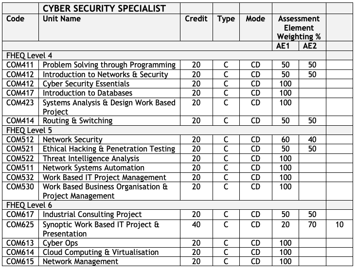

{: .no_toc }

#  BDATS - Cybersecurity Specialist

A cyber security specialist is responsible for the implementation, maintenance and support of the security controls that protect an organisation’s systems and data assets, ensuring security technologies and practices are operating in accordance with the organisation's policies and standards to provide continued protection. They are responsible for performing vulnerability assessments to evaluate an organisation's ongoing security and provide visibility to management of the main risks and control status on an ongoing basis. They also respond to security incidents and implement resolution activities across an organisation. Cyber security specialists require a broad understanding of network infrastructure, software and data to identify where threat and hazard can occur.

