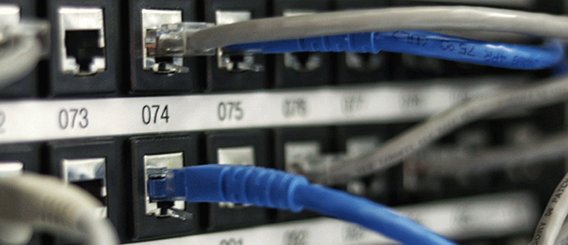

{: .no_toc }

#  BDATS - Network Engineer

The primary role of a network engineer is to design, install, maintain and support communication networks within an organisation or between organisations. They need to maintain high levels of network performance and availability for users. They must also understand network configuration, cloud, network administration, and monitoring tools, and be able to give technical advice and guidance. Network engineers must be proficient in technology solutions to be able to analyse system requirements to ensure the network and its services operate to desired levels. Network engineers also understand data traffic and transmission across the network and have a major role to play in ensuring network security.

Module Details