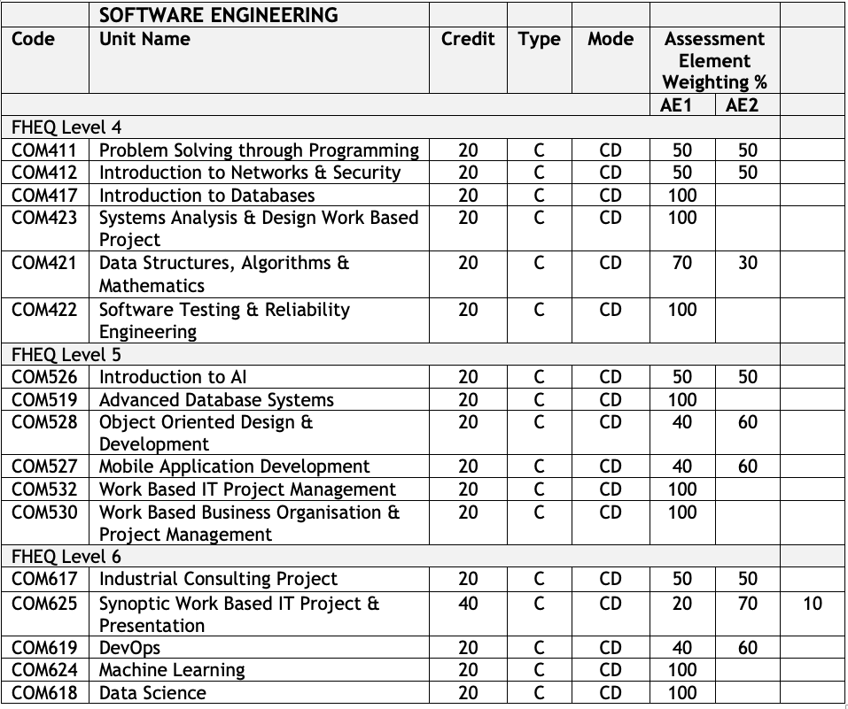

{: .no_toc }

#  BDATS - Software Engineer

A Software Engineer needs to be able to design, develop, build and test high-quality software solutions. This role requires apprentices to apply engineering principles at all levels of the software development process. This includes requirement gathering, analysis and design, development and data requirements, while ensuring security robustness is built in. Software engineers typically work as part of a larger collaborative team and will have responsibility for significant elements of software projects.

### Skills 

**Be able to:**

* Create effective and secure software solutions using contemporary software development languages to deliver the full range of functional and non-functional requirements using relevant development methodologies.
* Undertake analysis and design to create artefacts, such as use cases to produce robust software designs.
* Produce high quality code with sound syntax in at least one language following best practices and standards.
* Perform code reviews, debugging and refactoring to improve code quality and efficiency.
* Test code to ensure that the functional and non-functional requirements have been met.
* Deliver software solutions using industry standard build processes, and tools for configuration management, version control and software build, release and deployment into enterprise environments.

### Technical Knowledge

**Knows and understands:**

* How to operate at all stages of the software development lifecycle.
* How teams work effectively to develop software solutions embracing agile and other development approaches.
* How to apply software analysis and design approaches.
* How to interpret and implement a design, compliant with functional, non-functional and security requirements.
* How to perform functional and unit testing.
* How to use and apply the range of software tools used in Software engineering.

Module Details